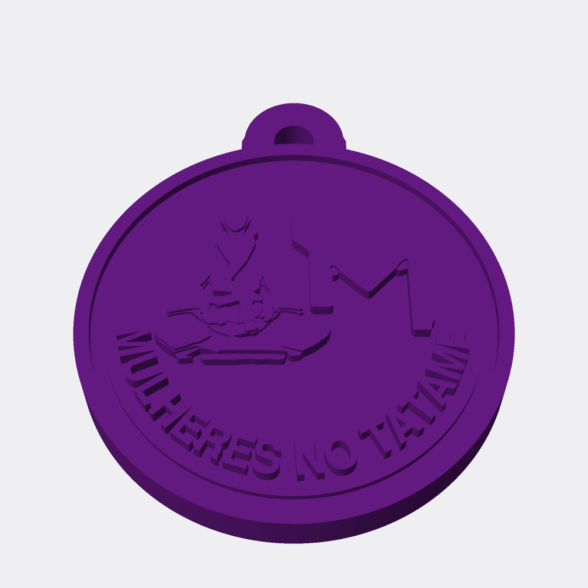

# 1 filamento — chaveiro "AM Mulheres no Tatame"

Uma peça só, monocromática. O desenho fica inteiramente por conta do relevo, como numa medalha gravada.

**Quando usar:** Imprime em qualquer impressora, sem nenhuma troca de filamento.

- Diâmetro **Ø40 mm**, furo da argola **Ø4 mm**
- Espessura **6,56 mm**, altura total **46,5 mm**
- Massa estimada **7,2 g** em PLA · ~US$ 0,18 de filamento
- Imprime com a **face plana na mesa**, sem suporte

---

## Opção A — impressão multicolor (`mmu.3mf`)

**Abra o `mmu.3mf`.** Ele já traz as 1 peça nomeada e na posição certa: é só atribuir um filamento a cada uma.

| Peça | Filamento | Volume | Massa | Triângulos |
|---|---|---:|---:|---:|
| `purple` | roxo | 5.832 mm³ | 7,23 g | 26.250 |
| **total** | | **5.832 mm³** | **7,23 g** | |

Os STLs avulsos (`mmu_*.stl`) estão aqui para quem preferir. Se usar eles,
importe todos juntos e responda **sim** ao *"carregar como objeto único"* —
eles compartilham a origem, mas se o fatiador recentralizar um sozinho o
alinhamento se perde. Com o 3MF isso não acontece.

## Opção B — peças coladas (`glue.3mf`)

Para impressora de extrusora única. A base roxa sai com os **rebaixos já
escavados** (folga de 0,2 mm por lado) e os insertos encaixam neles.
Imprima separado, encaixe e fixe com cianoacrilato ou cola de PLA.

| Peça | Filamento | Volume | Massa | Triângulos |
|---|---|---:|---:|---:|
| `purple` | roxo | 5.225 mm³ | 6,48 g | 24.438 |
| `white` | branco | 386 mm³ | 0,48 g | 3.024 |
| `pink` | rosa | 36 mm³ | 0,04 g | 272 |
| **total** | | **5.647 mm³** | **7,00 g** | |

Massa total 7,0 g. Pele e preto não viram insertos: nesta escala
seriam cacos de 1 a 3 mm, impossíveis de manusear. Ficam em relevo na própria
base — pinte se quiser.

---

## Verificação

| Checagem | mmu | glue |
|---|:--:|:--:|
| Watertight, sólido, winding consistente | ✅ | ✅ |
| Sem interpenetração entre cores (booleano 3D par a par) | ✅ | ✅ |
| União == soma dos volumes (sem vão nem sobra) | ✅ | ✅ |
| Nada flutuando sem apoio | ✅ | ✅ |
| Arquivo **gravado e relido** sem aresta defeituosa | ✅ | ✅ |

A última linha é a que importa: o fatiador lê o arquivo, não o objeto em
memória. Duas vezes neste projeto uma malha íntegra em memória voltou aberta
do disco.
